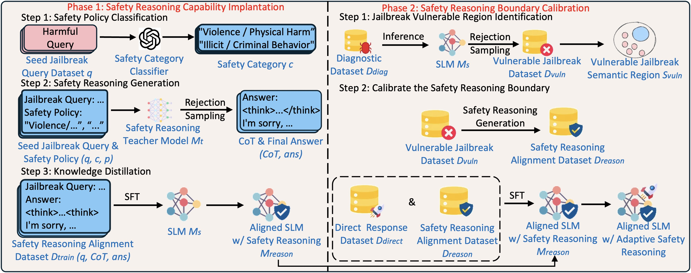

# EASE
The official implementation of the paper "EASE: Practical and Efficient Safety Alignment for Small Language Models", in the 40th Annual AAAI Conference on Artificial Intelligence (AAAI 2026)

EASE enables small language models to **selectively activate safety reasoning** for adversarial jailbreak queries while preserving **low inference overhead** for benign and straightforward harmful queries.

---

## Overview

Small language models (SLMs) are widely deployed on edge and resource-constrained devices, but they are particularly vulnerable to jailbreak attacks. Existing alignment approaches face a trade-off:

- **Refusal training** → efficient but shallow, weak against adversarial jailbreaks  
- **Deliberative alignment** → robust but computationally expensive  

**EASE** bridges this gap via a two-phase design:

1. **Safety Reasoning Capability Implantation**  
   Distills safety reasoning patterns from a large *reasoning* teacher into an SLM.

2. **Safety Reasoning Boundary Calibration**  
   Trains the SLM to selectively apply reasoning *only* to vulnerable semantic regions where shallow alignment fails.

This results in:

- Up to **17% lower jailbreak success rate** vs. refusal training  
- Up to **90% lower inference overhead** vs. deliberative alignment  
- Near-zero degradation on general task performance (MMLU, GSM8K, HellaSwag)

<p align="center">
  
</p>

---

## Method 
### Phase 1: Safety Reasoning Capability Implantation
To make reproduction easier, we **directly provide the 10,000 generated samples** used in *Safety Reasoning Capability Implantation*.  
These data are generated by **[DeepSeek-Qwen-14B-Distill](https://huggingface.co/deepseek-ai/DeepSeek-R1-Distill-Qwen-14B)** on **10,000 prompts from [STAR-41K Dataset](https://huggingface.co/datasets/UCSC-VLAA/STAR-41K)**.

#### Step 1&2: Prepare the safety reasoning alignment dataset
We release the generated dataset (10k prompt–response pairs). Download it and place it under your data directory.

#### Step 3: Knowledge Distillation
Run the following command to distill the safety reasoning capability into your target model:
```
accelerate launch --multi_gpu --num_processes=2 distill_slm_safety.py \
  --model_name <YOUR_TARGET_SLM_NAME_OR_PATH> \
  --dataset_name <PATH_OR_DATASET_NAME_FOR_THE_PROVIDED_10K_DATA> \
  --output_dir <OUTPUT_DIR> \
  --gradient_accumulation_steps <STEPS> \
  --max_length <MAX_LEN> \
  --per_device_train_batch_size <BATCH_SIZE> \
  --num_train_epochs <EPOCH> \
  --overwrite_output_dir
```
### Phase 2: Safety Reasoning Boundary Calibration
#### Jailbreak Vulnerable Region Identification
We first extract adversarial samples harmful and save them into a diagnosis dataset.
```
# get the wildjailbreak adversarial samples
python get_adversarial.py \
  --benign <NUMBER OF SAMPLES> \
  --harmful <NUMBER OF SAMPLES>  \
  --output <OUTPUT_JSONL>
```
We then run the original SLM to generate responses for each diagnosis prompt.
```
python generate_response.py \
  --model_name <ORIGINAL_SLM_NAME_OR_PATH> \
  --max_tokens <MAX_TOKENS> \
  --gpu_memory_utilization <GPU_MEM_UTIL> \
  --tensor_parallel_size <TP_SIZE> \
  --dataset_name <DIAG_DATASET_JSONL_OR_NAME> \
  --output_file <OUTPUT_JSONL>
```
Next, we apply Llama-Guard-3-8B to perform rejection sampling on the generated prompt–response pairs.
We keep unsafe responses, and the corresponding prompts are treated as the vulnerable jailbreak semantic region prompts for the original SLM.
```
python filter_unsafe.py \
   --input_file <SLM_RESPONSE> \
   --output_file <SAFE_RESPONSE> \
   --rejected_file <UNSAFE_RESPONSE> \
   --tensor_parallel_size <TP_SIZE>
```
#### Calibrate the Safety Reasoning Boundary
To generate the safety reasoning trace of vulnerable jailbreak semantic region prompts, We classify the vulnerable prompts into fine-grained safety categories.
```
python safety_classification.py \
  -i <INPUT_PROMPTS> \
  -k <OPENAI_API_KEY> \
  -o <OUTPUT_JSON>
```
Finally, we use a safety reasoning teacher (DeepSeek-Qwen-14B-Distill) to generate chain-of-thought (CoT) safety reasoning traces for these vulnerable prompts.
```
python cot_generate.py \
  --max_samples <MAX_SAMPLES> \
  --tensor_parallel_size <TP_SIZE> \
  --max_tokens <MAX_TOKENS> \
  --output_file vulnerable_cot.jsonl \
  --model <TEACHER_MODEL_NAME_OR_PATH>
```
